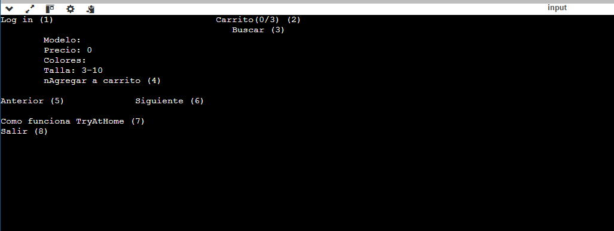
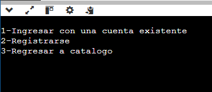
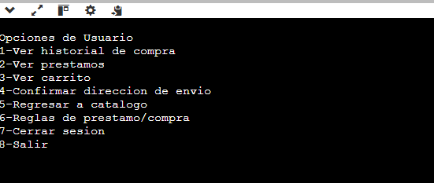

# TryHome - Internal Store System

**TryHome** is an internal store management system developed in C designed to streamline the management of store inventory, sales, and customer interactions. This system provides a user-friendly interface for employees to handle day-to-day store operations efficiently.






## Table of Contents
- [Features](#features)
- [Installation](#installation)
- [Usage](#usage)
- [File Structure](#file-structure)
- [Contribution](#contribution)
- [License](#license)

## Features
- Inventory management (add, update, delete items)
- Sales tracking and reporting
- Customer management (add, update, delete customers)
- User authentication for secure access
- Simple command-line interface
- Data persistence using file storage

## Installation

### Prerequisites
- C compiler (e.g., GCC)
- Makefile utility (optional, for building)

### Steps to Install
1. Clone the repository:
   ```bash
   git clone https://github.com/your-username/tryhome.git
